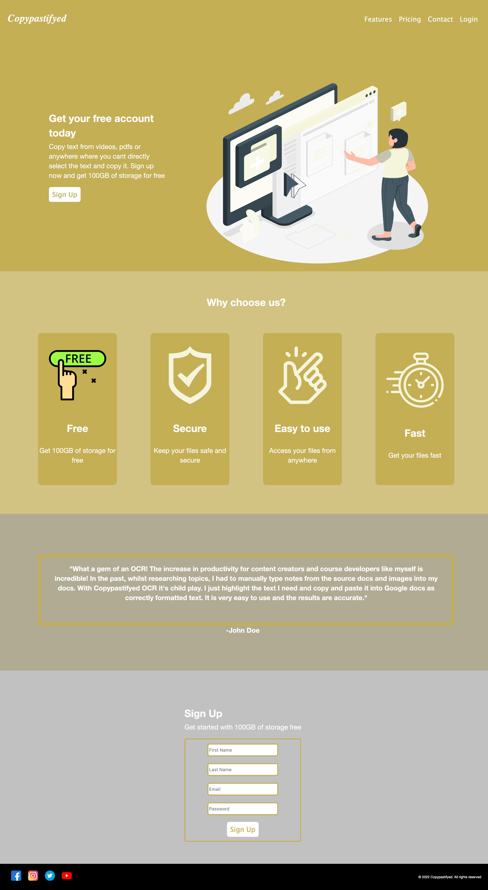

# Landing-page
A simple SaaS landing page using pure CSS (flexbox) & HTML.

## Screenshot

## Demo

[CLICK HERE TO SEE THE DEMO](https://mosmn.github.io/Landing-page/)

## Approach

I used flexbox to create the layout of the page. I used the `order` property to change the order of the elements in the page. I used the `flex-grow` property to make the elements grow and shrink according to the size of the screen. I used the `flex-basis` property to set the initial size of the elements. I used the `flex-shrink` property to make the elements shrink according to the size of the screen. I used the `flex-wrap` property to make the elements wrap according to the size of the screen. I used the `align-items` property to align the elements vertically. I used the `justify-content` property to align the elements horizontally. I used the `align-self` property to align the elements vertically. I used the `align-content` property to align the elements vertically. I used the `flex-direction` property to change the direction of the elements. I used the `flex` property to set the `flex-grow`, `flex-shrink`, and `flex-basis` properties in one line. I used the `align-self` property to align the elements vertically.

## Challenges

I had to figure out to get everything to align perfectly with each other. I had to figure out how to make the elements wrap according to the size of the screen. I had to figure out how to make the elements grow and shrink according to the size of the screen. I had to figure out how to make the elements shrink according to the size of the screen. I had to figure out how to make the elements align vertically. I had to figure out how to make the elements align horizontally. I had to figure out how to make the elements align vertically. 